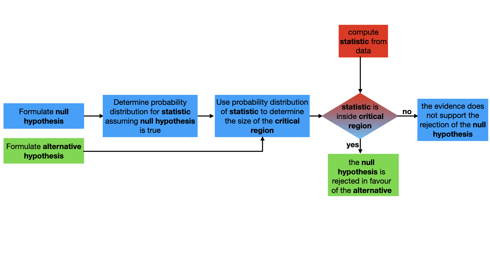

# The critical region

Consider the flowchart for hypothesis testing once more:



Notice that the boxes for both the __null__ and __alternative hypothesis__ are connected to the box about determining the __critical region__.  Both of these boxes are connected here as both the __null__ and __alternative hypothesis__ are used when we determine the __critical region__.  It is useful to think about what we would do if were only using the null hypothesis to set the size of the critical region.  

Let's suppose that we know what the distribution for the test statistic is under the null hypothesis and that we want to perform our test at the 5% __significance level__.  By setting the significance level in this way we are stating that the probability that the __test statistic__ falls within the __critical region__ should be 5% if the null hypothesis is true.  There are, however, an infinite number of ways to set the critical region so as to ensure so that the probability of being in within it is 5%.

__By completing the task on the left you will demonstrate that you understand this idea.__  To complete this task you will need to consider a 95% __confidence limit__.  To give you a sense of what this means if we were doing a hypothesis test and if the statistic fell within this __confidence limit__ the __null hypothesis__ would __not__ be rejected.  In other words, for a hypothesis test, the part of the real axis that does not include the __critical region__ is one possible __confidence limit__.  

Within the file named `main.py`, I have started writing a function called `upperBound`.  This function takes a single argument `a`.  This input value, `a` is the `lower` bound for the confidence limit.  I am assuming that the __test statistic__, in this case, is a sample from a normal distribution with expectation 0 and variance 1.  You can thus calculate the probability that the test statistic is less than a by using the following command:

````
plta = scipy.stats.norm.cdf(a) 
````

If you then take the value that this command outputs and perform the following operation you will recover the value of `a` 

````
a = scipy.stats.norm.ppf(plta)
````

Once it is given the value of a the function `upperBound` should determine and return a second value `b>a`.  The value of `b` should be set so that the probability that a normal random variable expectation 0 and variance 1 is greater than `a` and less than `b` is 95%. 

Once you have completed the `upperBound` function a graph will be produced that illustrates the different 95% confidence limits we might use if we are only permitted to use the null hypothesis. 
